# [Code Maker for toio™](https://akichika.github.io/code-maker-for-toio/)

**ブラウザだけで動く** toio ビジュアルプログラミング IDE。  
Scratch 風のブロックでコーディングし、WebBluetooth でリアルタイムに toio キューブを制御できます。

**すぐに試したい方はこちら:[Code Maker for toio™](https://akichika.github.io/code-maker-for-toio/)**


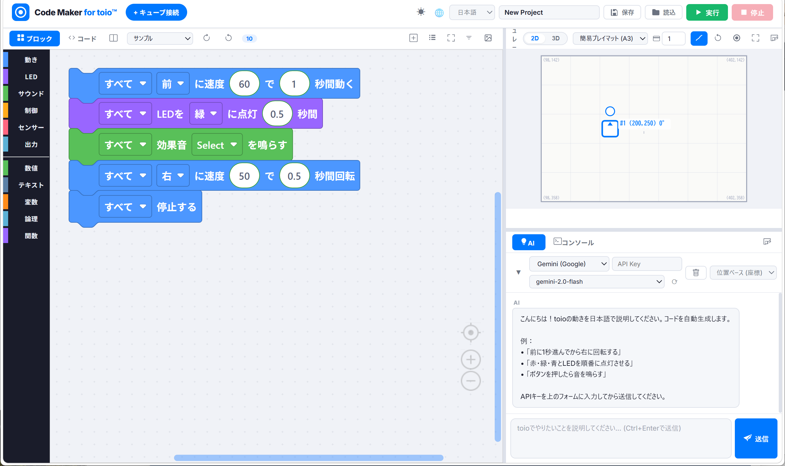

---

## 特徴 / Features

| 機能 | 説明 |
|------|------|
| 🧩 **ビジュアルプログラミング ワークスペース** | Scratch 風ブロックで直感的にプログラム作成。動き・LED・サウンド・センサー・制御ブロックを完備 |
| 📡 **WebBluetooth 実機接続** | ブラウザから直接 toio キューブに Bluetooth 接続。最大 4 台同時制御 |
| 🖥️ **2D/3D シミュレーター** | 実機がなくてもシミュレーターで動作確認。マット座標をリアルに再現 |
| 📸 **カードスキャナー** | toio Playground Command カードをカメラ / 写真で撮影してブロックに自動変換※ |
| 🤖 **AI コード生成** | Gemini / OpenAI / Claude API を使って日本語の指示からブロックを自動生成※ |
| 📝 **コード表示** | JavaScript・疑似 Python コードをリアルタイム表示・編集・ダウンロード |
| 🌐 **多言語対応** | 日本語 / English / 中文 を即時切替 |
| 🎨 **テーマ** | ライト / ダーク / ハイコントラスト |
| 💾 **プロジェクト保存** | ワークスペースを XML で保存・読込 |

※AI機能を使うには各種AIサービス（OpenAI, Gemini, Claude）のAPI Keyが必要です。各自ご用意ください。

---

## 画面構成 / UI Layout


## スクリーンショット / Screenshots

### ① ビジュアルプログラミング ワークスペース

<!-- SCREENSHOT: docs/screenshots/blockly_workspace.png -->
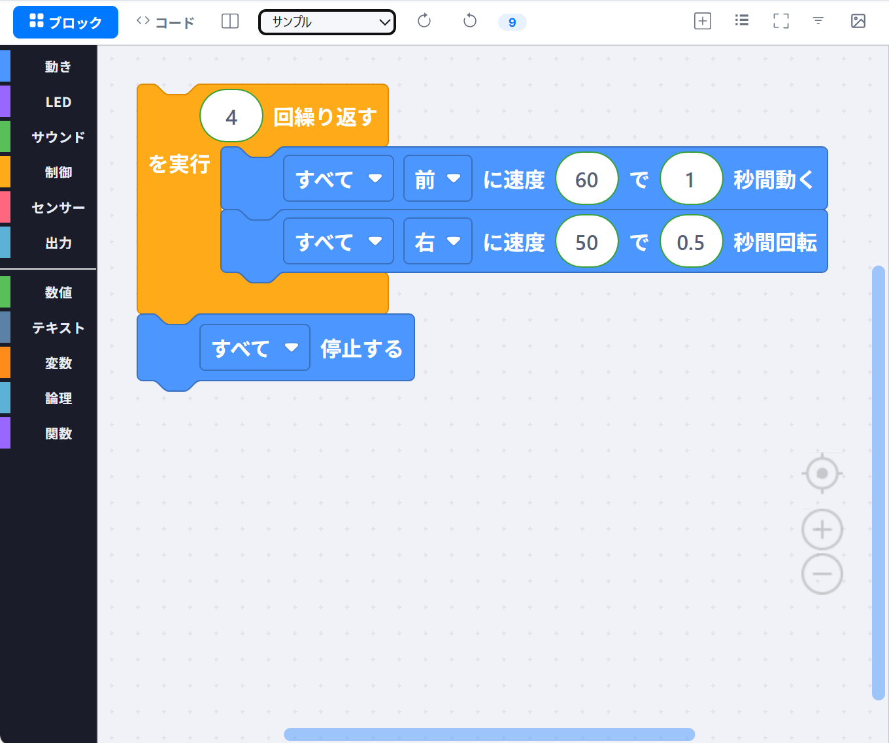

ブロックをドラッグ＆ドロップで組み合わせてプログラムを作成します。  
カテゴリは**動き・LED・サウンド・制御・センサー・出力**の 6 種類。

---

### ② 2D/3D シミュレーター

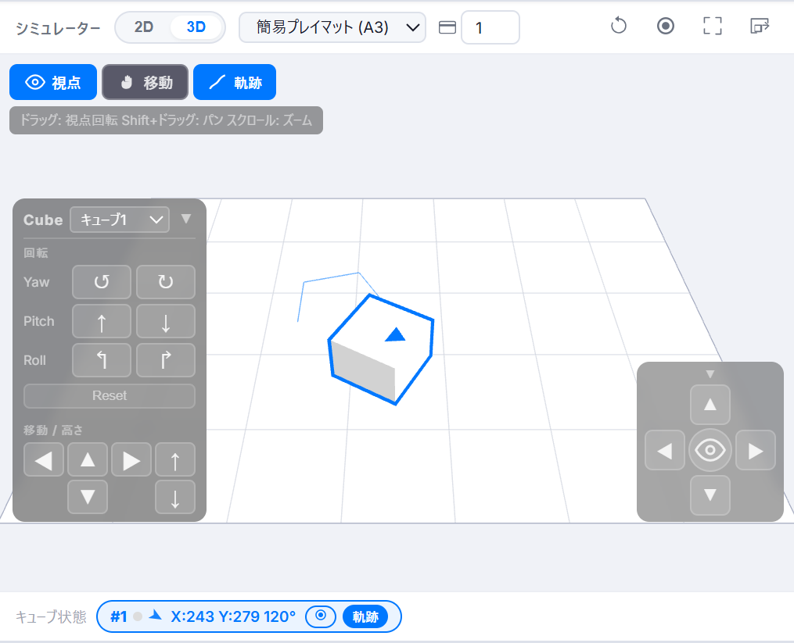

- 各種toio専用マットに対応
  - **簡易プレイマット (A3)**: 座標 (98, 142)〜(402, 358)
  - **トイコレマット(表)**: 座標 (45, 45)〜(455, 455)
  - **カスタムマット**: 任意の座標範囲を登録可能
- 全画面表示も可能

---

### ③ カードスキャナー

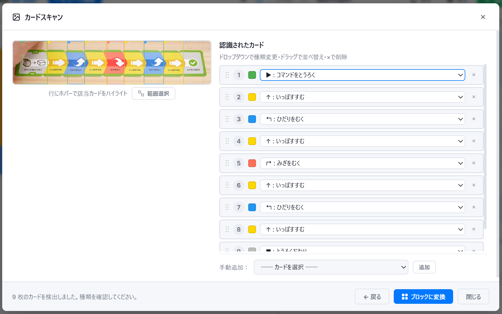

toio Playground Command カードをカメラや画像ファイルで読み取り、Blockly ブロックに自動変換します。

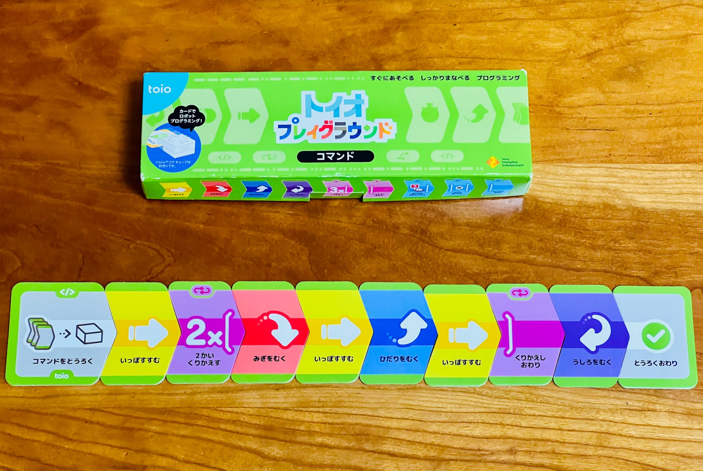
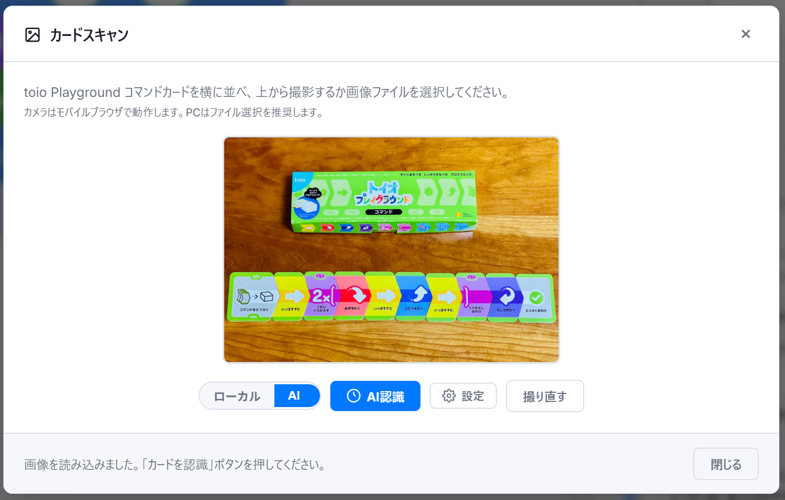
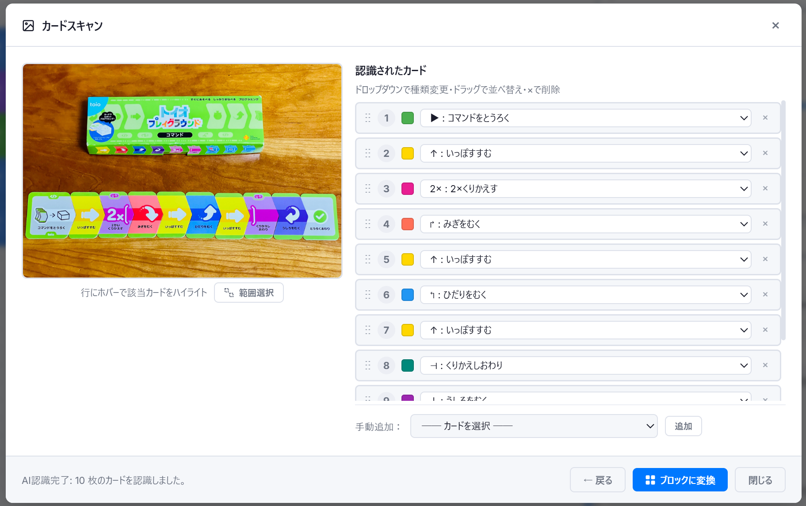
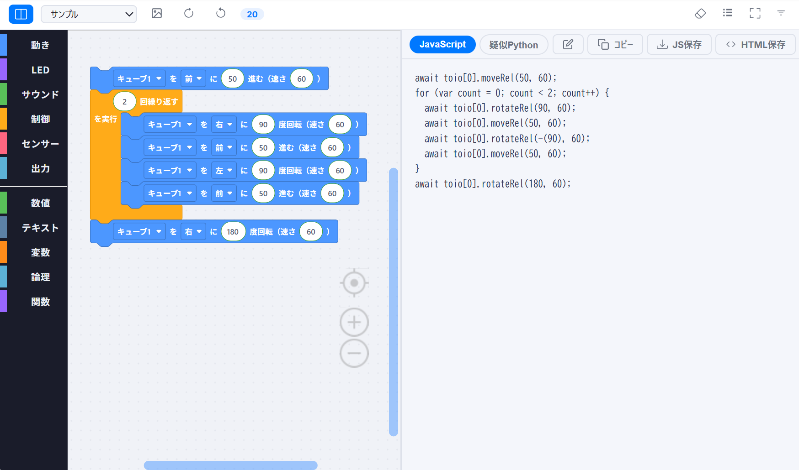


**ローカル認識 (AI 不要)**:  
カードの色・アイコンのピクセル解析で 24 種類のカードを識別。

**AI 認識 (Gemini / OpenAI / Claude)**:  
LLM の視覚能力で高精度なカード認識を実現。

**対応カード一覧:**

| カード色 | カード種類 |
|----------|-----------|
| 🟢 緑 | コマンドをとうろく |
| 🟡 黄 | いっぽすすむ |
| 🟣 紫 | うしろをむく |
| 🔵 青 | ひだりをむく |
| 🩷 コーラル | みぎをむく |
| 🌸 ピンク | 2×/3× くりかえす |
| 🟠 オレンジ | 4×/5× くりかえす・1〜3かいまつ |
| 🩵 シアン | 1/2 かいまつ・はてなのゆかにいたら・びっくりのゆかにいたら |
| ⬜ グレー | もし〜なら・そうでなければ・とうろくおわり |
| 🔴 赤 | AND・OR |
| 🩵 ダークティール | ∞くりかえす・くりかえしおわり・こうどう1/2 |

---

### ④ AI コード生成タブ

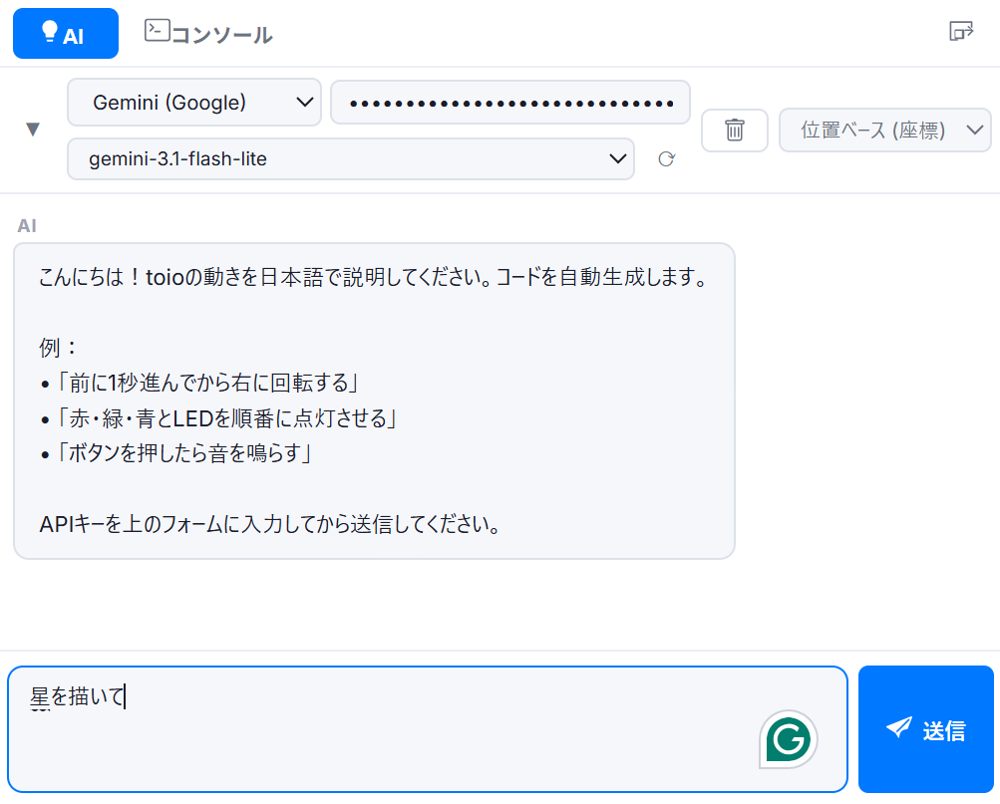

日本語の指示を入力すると Blockly ワークスペースを AI が自動更新します。  
API キーは設定ダイアログから入力（ブラウザのローカルストレージに保存）。

---

### ⑤ コード表示

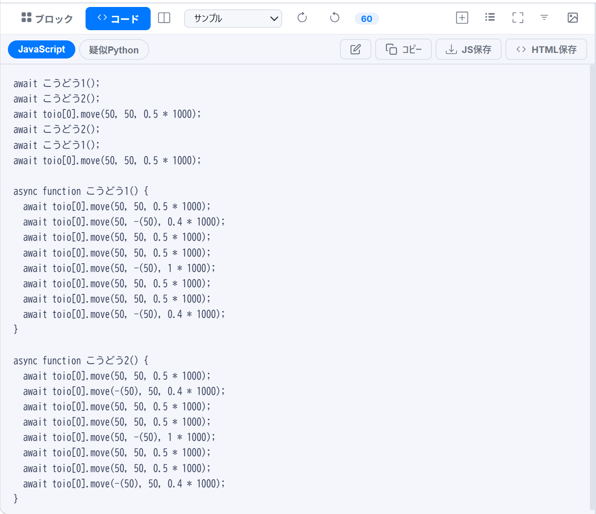

- **JavaScript**: ブロックから生成されたコードをリアルタイム表示・編集
- **疑似 Python**: 学習用 Python 風コードを出力
- **HTML 保存**: シミュレーター込みのスタンドアロン HTML をダウンロード
- **コンソール**: 実行ログ・エラーをリアルタイム表示

---

### ⑥ テーマ

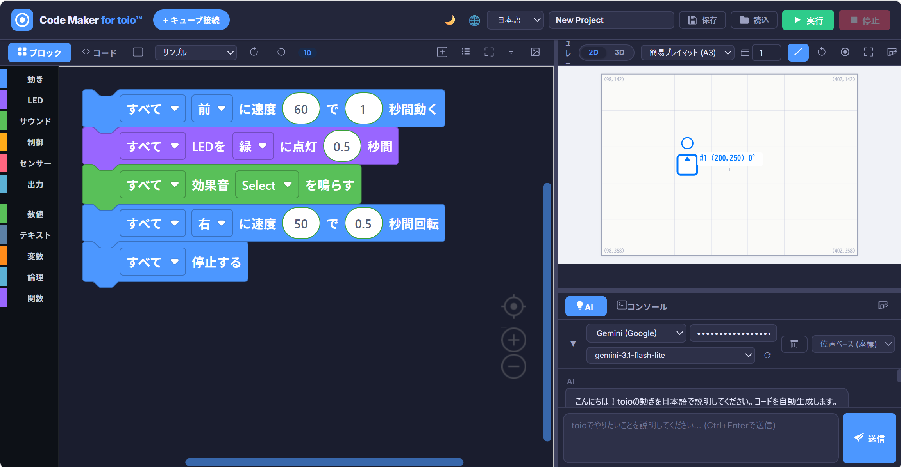

ヘッダー右上の `☀` ボタンで切替:  
**ライト** → **ダーク** → **ハイコントラスト** → ライト…

---

## 動作環境 / Requirements

| 要件 | 詳細 |
|------|------|
| ブラウザ | Chrome / Edge (最新版推奨) |
| WebBluetooth | Chrome 56+ / Edge 79+ |
| OS | Windows / macOS / Android (Chrome) |
| サーバー | ローカルファイルサーバー (WebBluetooth には HTTPS または localhost が必要) |
| toio | toio コア キューブ (オプション。シミュレーターのみなら不要) |

> **注意**: WebBluetooth は Firefox・Safari では未対応。  
> Safari (iOS) では動作しません。

---

## 使い方 / Quick Start

**すぐに試したい方はこちら:[Code Maker for toio™](https://akichika.github.io/code-maker-for-toio/)**

### 1. ローカルサーバーの起動

```bash
# Python 3 (推奨)
cd code-maker-for-toio
python -m http.server 3333

# または Node.js (npx serve)
npx serve . -p 3333
```

ブラウザで `http://localhost:3333` を開きます。

### 2. シミュレーターで動かす (実機不要)

1. ブラウザで `http://localhost:3333` を開く
2. Blockly ワークスペースでブロックを組む
3. **実行** ボタン (▶) を押す → シミュレーター上でキューブが動く

### 3. 実機 (toio キューブ) を接続

1. toio キューブの電源を入れる
2. **+ キューブ接続** ボタンをクリック
3. Bluetooth 選択ダイアログからキューブを選択
4. 接続後、**実行** ボタンを押すと実機が動く

### 4. カードスキャナーを使う

1. ヘッダーの **カードスキャン** ボタン (📷) をクリック
2. カメラまたはファイルでカードの写真を撮る
3. **認識開始** → カードが自動識別される
4. 確認して **ブロックに変換** → ワークスペースに反映

### 5. AI でブロックを生成する

1. 右パネルの **AI** タブを開く
2. 歯車アイコンから API キーを設定 (Gemini / OpenAI / Claude)
3. テキストボックスに指示を入力 (例: 「前に進んでから右に曲がる」)
4. 送信 → AI がブロックを自動生成

---

## ファイル構成 / File Structure

```
code-maker-for-toio/
├── index.html          # メインHTML (UI全体)
├── css/
│   └── style.css       # スタイル (toioブルー基調、3テーマ対応)
├── js/
│   ├── i18n.js         # 多言語定義 (JA/EN/ZH) + t() ヘルパー
│   ├── messages.js     # Blockly日本語メッセージ
│   ├── blocks.js       # カスタムBlocklyブロック定義
│   ├── generators.js   # JavaScript / Python コードジェネレーター
│   ├── toio.js         # WebBluetooth + toio BLE プロトコル
│   ├── simulator.js    # 2Dシミュレーター (Canvas 2D)
│   ├── runtime.js      # プログラム実行エンジン
│   ├── app.js          # UIオーケストレーション
│   ├── llm.js          # LLM API クライアント (Gemini/OpenAI/Claude)
│   └── card-scanner.js # カードスキャナー (画像認識 + LLM)
└── docs/
    └── screenshots/    # READMEスクリーンショット
```

---

## 使用技術 / Tech Stack

| ライブラリ | バージョン | 用途 |
|-----------|-----------|------|
| [Blockly](https://developers.google.com/blockly) | 9.3.3 | ビジュアルプログラミング |
| [Three.js](https://threejs.org/) | r128 | 3D描画 (シミュレーター予備) |
| [Web Bluetooth API](https://developer.mozilla.org/docs/Web/API/Web_Bluetooth_API) | ブラウザ標準 | toio BLE通信 |
| [Canvas 2D API](https://developer.mozilla.org/docs/Web/API/Canvas_API) | ブラウザ標準 | シミュレーター・カードスキャン |
| [Inter](https://fonts.google.com/specimen/Inter) (Google Fonts) | — | UIフォント |

**依存関係はすべて CDN** — `npm install` 不要。`index.html` を開くだけで動作します。

---

## 対応ブロック / Supported Blocks

### 動き (Motion)
- キューブを前/後に進む (速さ・時間指定)
- 左/右に曲がる
- 左右モーター直接制御
- 座標指定移動 (X, Y, 角度)
- 相対移動・相対回転
- 停止

### LED
- RGB 値で点灯
- カラー名で点灯 (赤・緑・青・白・黄・シアン・ピンク・消灯)
- 消灯

### サウンド
- 効果音 (Entry/Select/Cancel/Cursor/Mat/Item/Score/Error)
- 音符再生 (C4〜E5)
- 停止

### 制御 (Control)
- N秒待つ
- ボタン押下を待つ
- 繰り返す (回数指定・無限・条件付き)
- もし〜なら / そうでなければ
- こうどう (カスタム関数) 呼び出し

### センサー (Sensing)
- ボタン状態
- 水平状態
- バッテリー残量
- 座標 X / Y
- 角度

---

## カードスキャナー詳細

### 認識アルゴリズム (ローカル)

1. 画像をスケールダウンして Canvas に描画
2. 7段階の Y レベルで横方向スキャン → HSL サンプリング
3. 多数決でストリップごとの色グループを決定
4. 隣接する同色ストリップを結合してカード領域を検出
5. カード内のピクセル解析でサブカテゴリを識別:
   - オレンジ: 暗ピクセル密度で wait_1〜3 / repeat_4〜5 を区別
   - シアン: HSL で赤/濃青アイコンを検出 → hatena / bikkuri / half_chance
   - 赤: 中央縦ストリップの上半部 vs 下半部密度で ∧ (AND) / ∨ (OR) を判別
   - ダークティール: 左右密度 + 全体密度で repeat_inf / repeat_end / action_1 / action_2 を判別

### カード変換ルール

| カード | Blockly ブロック | 備考 |
|--------|----------------|------|
| いっぽすすむ | `toio_move` (FORWARD) | 速さ・時間は設定ダイアログで調整 |
| ひだりをむく / みぎをむく | `toio_turn` | — |
| N×くりかえす | `controls_repeat_ext` | N = 2〜5 |
| ∞くりかえす〜くりかえしおわり | `controls_whileUntil` (WHILE TRUE) | — |
| N かいまつ | `toio_wait` (SECONDS = waitDuration × N) | waitDuration は設定で変更 |
| もし〜なら〜もしおわり | `controls_if` | else ブランチ自動検出 |
| はてなのゆかにいたら | `controls_if` (変数 `はてなのゆか`) | — |
| びっくりのゆかにいたら | `controls_if` (変数 `びっくりのゆか`) | — |
| AND / OR | `logic_operation` | 浮動ブロックとして配置 |
| こうどう1 / こうどう2 | `procedures_callnoreturn` + `procedures_defnoreturn` | 呼び出しと定義を自動生成 |

---

## 設定 / Settings

カードスキャナーの**設定**ダイアログ (歯車アイコン) から変更できます:

| 項目 | デフォルト | 説明 |
|------|-----------|------|
| 速さ (前後) | 50 | `toio_move` の速さ |
| 時間 (前後) | 0.5秒 | `toio_move` の時間 |
| 速さ (回転) | 50 | `toio_turn` の速さ |
| 時間 (回転) | 0.4秒 | `toio_turn` の時間 (90°) |
| 待ち時間 (秒/回) | 1.0秒 | かいまつカード1回あたりの秒数 |
| モード | 時間指定 | 時間指定 / 座標指定 |

---

## ブラウザサポート / Browser Support

| ブラウザ | バージョン | WebBluetooth | 備考 |
|---------|-----------|-------------|------|
| Chrome | 56+ | ✅ | 推奨 |
| Edge | 79+ | ✅ | 推奨 |
| Firefox | — | ❌ | 未対応 |
| Safari | — | ❌ | 未対応 |
| Chrome Android | 56+ | ✅ | モバイルにも対応 |

---

## 開発・改造 / Development

### ローカルで開発する

```bash
git clone https://github.com/akichika/code-maker-for-toio.git
cd code-maker-for-toio
python -m http.server 3333
# → http://localhost:3333
```

### ファイルを変更したら

CSS/JS の変更は `index.html` 内の `?v=N` バージョン番号を上げてキャッシュをクリアしてください:

```html
<link rel="stylesheet" href="css/style.css?v=6">   <!-- +1 -->
<script src="js/app.js?v=16"></script>              <!-- +1 -->
```

### カスタムブロックを追加するには

1. `js/blocks.js` に `Blockly.defineBlocksWithJsonArray([{...}])` でブロック定義を追加
2. `js/generators.js` に `Blockly.JavaScript['block_type'] = ...` でコードジェネレーターを追加
3. `index.html` の `<xml id="toolbox">` にカテゴリとブロック参照を追加
4. `js/i18n.js` に多言語ラベルを追加

---

## ライセンス / License

[MIT License](LICENSE)

Copyright (c) 2026 akichika

---

## 免責 / Disclaimer

- **toio™** は株式会社ソニー・インタラクティブエンタテインメントの商標または登録商標です。
- このプロジェクトは非公式のファンメイドツールです。ソニー・インタラクティブエンタテインメントとは無関係です。
- **トイオ・プレイグラウンド コマンド** は株式会社ソニー・インタラクティブエンタテインメントの製品です。
- AI 機能の利用には各 API プロバイダー (Google / OpenAI / Anthropic) の利用規約が適用されます。

---

## 関連リンク / Links

- [toio 公式サイト](https://toio.io)
- [トイオ・プレイグラウンド コマンド](https://toio.io/titles/pg-cmd.html)
- [Blockly](https://developers.google.com/blockly)
- [Web Bluetooth API (MDN)](https://developer.mozilla.org/docs/Web/API/Web_Bluetooth_API)
